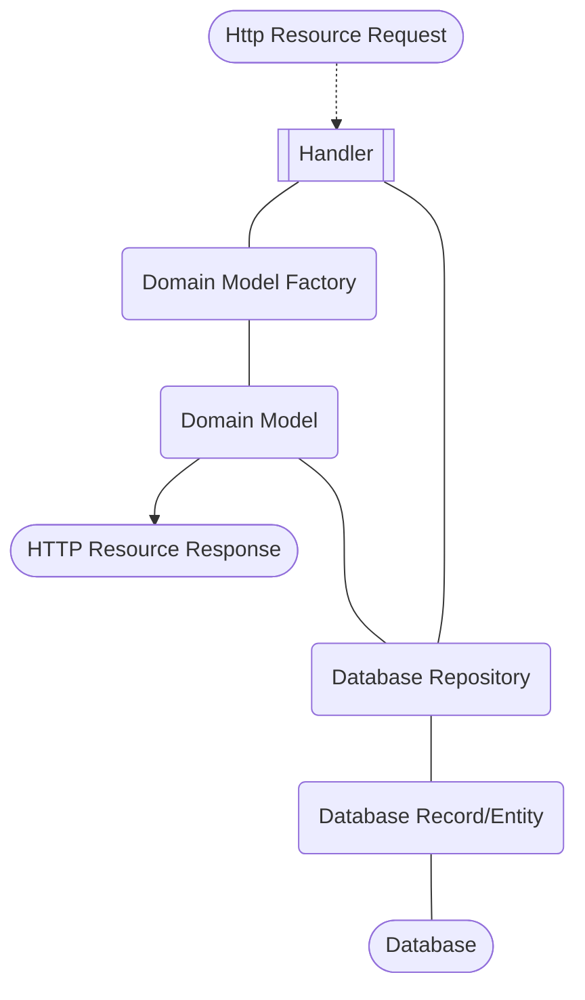

# Service Source

This is a pseudo-package that contains the business logic and Lambda handler definitions for the service.
The service is packaged up and deployed via the `/deploy` code.

## Handlers

Handlers are defined in `src/handler/{kind}/{operation}/handler.ts` using declarations and types that are defined in the `/client` package.
In most cases `{kind}` is going to be `api` but depending on the handlers event source it might be something like `sqs` for example.
Each handler should have its own unique `{operation}` (especially for `api` handlers) that map to the `swagger.yaml` definition and the name of the type declarations in `/client`.

The reason for `/client` is to provide a package that can be consumed by other services or frontend packages to supply up-to-date types and in some cases helper functions for calling the endpoints.
Please see the README in the `/client` directory for more information.

We are using a very bare bones approach to handler creation, a small package called `@phasma` allows for abstraction of common handler logic through a lightweight and type safe middleware implementation.

> Note that each handler needs an associated lambda handler definition in the `/deploy` directory also!

## Structure

Below is a rough diagram explaining data flow between domain entities.

To explain;

- All data passes through a `domain model`, these are created via the `domain model factory` or returned from a `database repository`. The purpose of this model is to introduce a consistent and safe means of working with the data within the service code.
- All database operations go through the `database repository` via a `database record` or `database entity`. This distinction is simply because we make use of `TypeORM` which has entities as a concept, but that doesn't allow for the strict queries that are requierd by our database cluster.
- Changes made to data are done against the `domain model` first, these models are immutable so mutations need to be done via the `domain model factory` (the same as creation).
- Finally http request and response bodies are represented as `http resource` models, these are just prettier or convinence views of the `domain model`.
